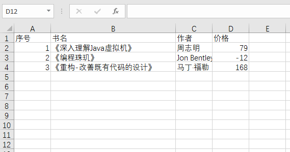

## 　导入 Excel 数据

> 通过一些第三方库提供的方法导入 Excel 数据十分简单，但是为了提高用户体验此方法在导入数据后又生成了导入结果文件，供用户查看导入结果。

### 介绍

通过不同的背景色，使其导入结果一目了然。

待导入文件：

[文件](../static/file/book.xls)

导入结果：

### 注意事项

由于“种种原因”，此代码存在以下问题：

1. 只适用导入 `xls` 文件，**不适用** `xlsx` 文件。（解决办法：提供 `xls` 格式的导入模板）
2. 前端调用导入接口时，应该使用一些特别策略才能下载导入结果文件（请和前端同学讨论如何解决，或者利用对象存储将文件上传后返回给用户文件链接）

